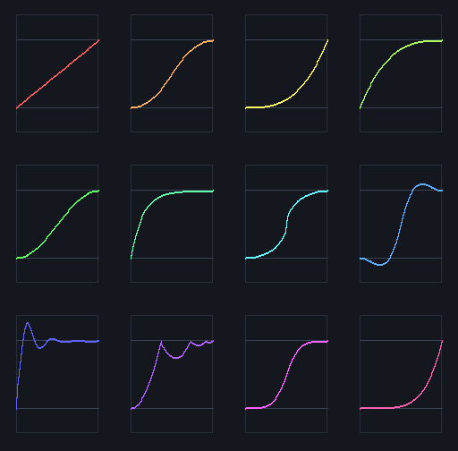

# sml-tween

[](https://github.com/sjqtentacles/sml-tween/actions/workflows/ci.yml)

30 easing functions and keyframe timeline tweening in pure Standard ML



*Generated by [`examples/easings.sml`](examples/easings.sml) (`make example`):
`Tween.ease` sampled over `[0,1]` for twelve easings, each plotted in its own
cell against the 0/1 guide lines (note the Back/Elastic/Bounce overshoot).
Rendered with the vendored `sml-raster` / `sml-image`.*

## Installation

```
smlpkg add github.com/sjqtentacles/sml-tween
smlpkg sync
```

## Usage

```sml
open Tween

(* Apply an easing function: ease maps [0,1] -> roughly [0,1].
   back/elastic/bounce intentionally overshoot. *)
val a = ease Linear  0.5   (* 0.5  *)
val b = ease QuadIn  0.5   (* 0.25 *)
val c = ease QuadOut 0.5   (* 0.75 *)

(* Linear interpolation: lerp start stop t = start + (stop - start) * t *)
val m = lerp 0.0 10.0 0.5  (* 5.0 *)

(* tween e a b t = lerp a b (ease e t) *)
val v = tween Linear 0.0 10.0 0.5  (* 5.0  *)
val w = tween QuadIn 0.0 10.0 0.5  (* 2.5  *)

(* Keyframe timeline: provide your own lerp for the value type. *)
val realLerp = fn a => fn b => fn t => a + (b - a) * t
val frames =
  [ { at = 0.0, easing = Linear, value = 0.0 }
  , { at = 1.0, easing = Linear, value = 10.0 }
  , { at = 2.0, easing = Linear, value = 20.0 }
  ]

val s0 = sample realLerp frames 0.0   (* 0.0  *)
val s1 = sample realLerp frames 0.5   (* 5.0  *)
val s2 = sample realLerp frames 2.0   (* 20.0 *)

(* Out-of-range time clamps to the first / last frame value. *)
val before = sample realLerp frames (~1.0)  (* 0.0  *)
val after  = sample realLerp frames 3.0     (* 20.0 *)
```

### Easing functions

All 30 standard Robert Penner easings are available as constructors of the
`easing` datatype:

```
Linear
QuadIn   QuadOut   QuadInOut
CubicIn  CubicOut  CubicInOut
QuartIn  QuartOut  QuartInOut
QuintIn  QuintOut  QuintInOut
SineIn   SineOut   SineInOut
ExpoIn   ExpoOut   ExpoInOut
CircIn   CircOut   CircInOut
BackIn   BackOut   BackInOut
ElasticIn ElasticOut ElasticInOut
BounceIn  BounceOut  BounceInOut
```

Every easing satisfies the boundary contract `ease e 0.0 = 0.0` and
`ease e 1.0 = 1.0`. The `back`, `elastic`, and `bounce` families overshoot
between the endpoints; the elastic curves are damped to stay within a
`[-0.3, 1.3]` envelope.

## Testing

```
make test       # MLton
make test-poly  # Poly/ML
```

## License

MIT
